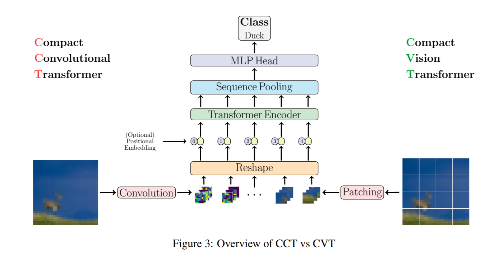

# Compact Convolution Transformers
This repo contain pytorch implementation of Compact Convolution Transformers as explained in the [Escaping the Big Data Paradigm with Compact Transformers](https://arxiv.org/abs/2104.05704) paper, for official implementation of this paper visit [here](https://github.com/SHI-Labs/Compact-Transformers)

## Usage:
```python
import torch
import numpy as np
from cct import CompactTransformer

img = torch.ones([1, 3, 224, 224])

cvt = CompactTransformer(224, 16, 1000) # For CVT

parameters = filter(lambda p: p.requires_grad, cvt.parameters())
parameters = sum([np.prod(p.size()) for p in parameters]) / 1_000_000
print('Trainable Parameters in CVT: %.3fM' % parameters)

out = cvt(img)

print("Shape of out :", out.shape)  # [B, num_classes]

cct = CompactTransformer(224, 16, 1000, conv_embed=True) # For CCT

parameters = filter(lambda p: p.requires_grad, cct.parameters())
parameters = sum([np.prod(p.size()) for p in parameters]) / 1_000_000
print('Trainable Parameters in CCT: %.3fM' % parameters)

out = cct(img)

print("Shape of out :", out.shape)  # [B, num_classes]
```
## Citation
```
@misc{hassani2021escaping,
      title={Escaping the Big Data Paradigm with Compact Transformers}, 
      author={Ali Hassani and Steven Walton and Nikhil Shah and Abulikemu Abuduweili and Jiachen Li and Humphrey Shi},
      year={2021},
      eprint={2104.05704},
      archivePrefix={arXiv},
      primaryClass={cs.CV}
}
```
